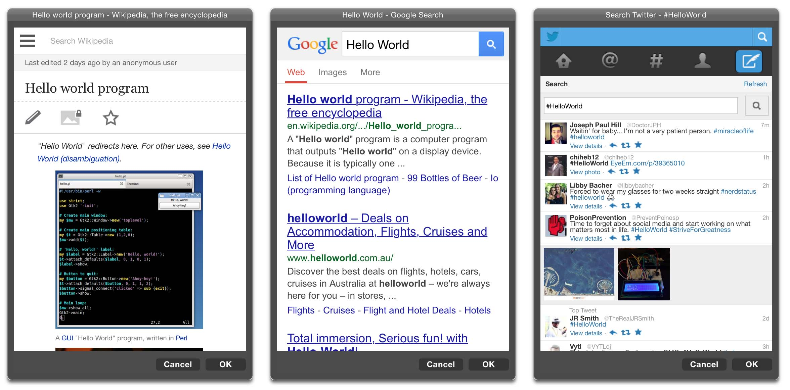

# Shortcuts *Beta* 
[`Download!`](Shortcuts.zip)
 #

A suite of Mac OS X services that add functionality to your Mac. These range from opening a web-page in a mobile-style window, allowing for quick wikipedia searches and hash-tag look-ups without leaving your app or webpage, to organising your window arrangement.

The best bit about it? These are all `.workflow` files, you can edit them in Automator to add additional functionality. If you want to get really deep you can edit the scripts in Python too; the scripts are well commented and documented to help you edit and understand them (the majority of them are just string manipulation anyway).

## Web-Shortcuts ##

A set of OS X services that opens a iPhone-sized mobile window over the top of your current application. What happens is based on your text selection when you activate the shortcut.

**Wikipeda**: Searches Wikipedia with your current selection.  
**Twitter**: Give the latest tweets using the selected text as a Hashtag. All spaces are removed.  
**Google**: Searches Google with your current selection.  
**Bing**: Searches Bing with your current selection.  
*More coming soon!*

## Window-Shortcuts ##

A set of three OS X services based on AppleScript that adjust the placement of your window.

**Move Window Left**: Moves the current window to the left half of the screen.
**Move Window Right**: Moves the current window to the right half of the screen.
**Maximise Window**: Makes the window fill the whole of the screen (not in fullscreen mode, though).